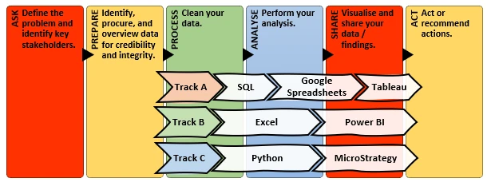

# Cyclistic Trilogy

## Executive Summary
To learn and compare different data analysis tools, I analysed a dataset three times, each time with different set of tools and, accordingly, a slightly different approach:
1. **[SQL → Google Spreadsheets → Tableau.](./trackA)** Exploratory data analysis of a sample of observations.
2. **[Excel → Power BI.](./trackB)** In-depth analysis prioritising cleaning and thoroughness.
3. **[Python → MicroStrategy.](./trackC)** Semi-automated analysis using statistical regression, with full dataset transfer into MicroStrategy. 

## Structure
The idea for this Trilogy started with the analysis in track A, which was part of the [Google Data Analytics Professional Certificate](https://www.coursera.org/professional-certificates/google-data-analytics). Naturally, I used Google’s approach to data analysis across all tracks. 

Google's approach to data analysis is composed of six phases: ask, prepare, process, analyse, share, and act.

*Figure 1: Methodology (based on Google's data analysis approach).*

## Data analysis
For details about the data analysis, see the folder for each analytical track:
* [SQL → Google Spreadsheets → Tableau](trackA)
* [Excel → Power BI](trackB)
* [Python → MicroStrategy](trackC).

## Meta-analysis (lessons learned)
I learned a lot about the different tools I used. 

* **Pleasantly surprised with Google Spreadsheets.** I genuinely had no idea it could be pushed to the extent I did, but it produced a fairly decent analysis without external aids. 
* **Still an Excel person if data is dirty or unfamiliar.** That said, Excel still allowed me to gain a familiarity with the data that no other tool can. What can I say!? The ability to look and touch each bit of data has value.
* **Everybody loves Python.** And, of course, Python is super nice once you already know the data or when you have a clean dataset. Painless, powerful, and straightforward.
* **Jury is still out on Tableau.** I must admit I still don't get Tableau fans. Granted, it produced a few cool graphs and it does have a certain aesthetic that is pleasing. However, I found it a bit restraining.
* **Power BI is the sure thing.** What can I say. It felt like driving a Toyota. The thing will take you where you need to go. Filters felt very easy to use, too. 
* **MicroStrategy is powerful!.** MicroStrategy is perhaps not the best choice for analysts working on many different and relatively-small ad-hoc topics. The learning curve is significant. That said, the thing flew through the full dataset like it was eating candy! I don't think I even have a dataset as big as one would need to really give MicroStrategy a run for its money.

It was also nice to see findings across tracks converge despite having taken slightly different approaches across tracks. The alignment between findings across tracks demonstrates there is no one single best approach to data analysis. 

## Conclusions
Tools are just tools. Making the most from them is enjoyable. It may also be the appropriate thing to do, but I'll leave that for others to decide.