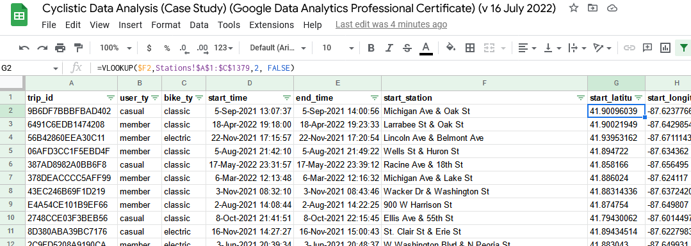
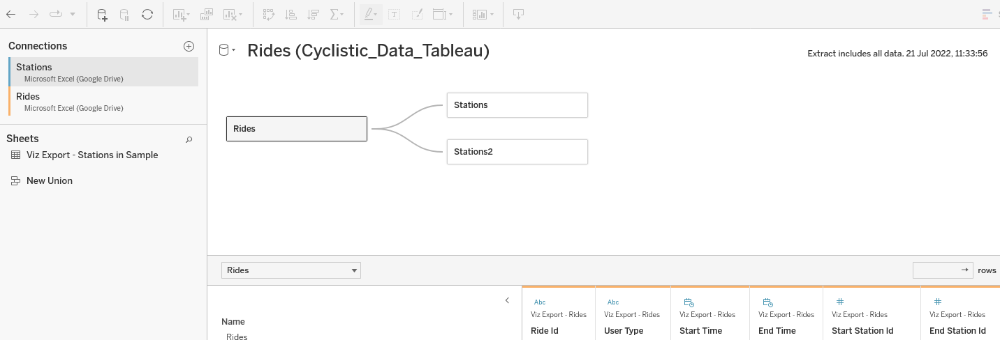
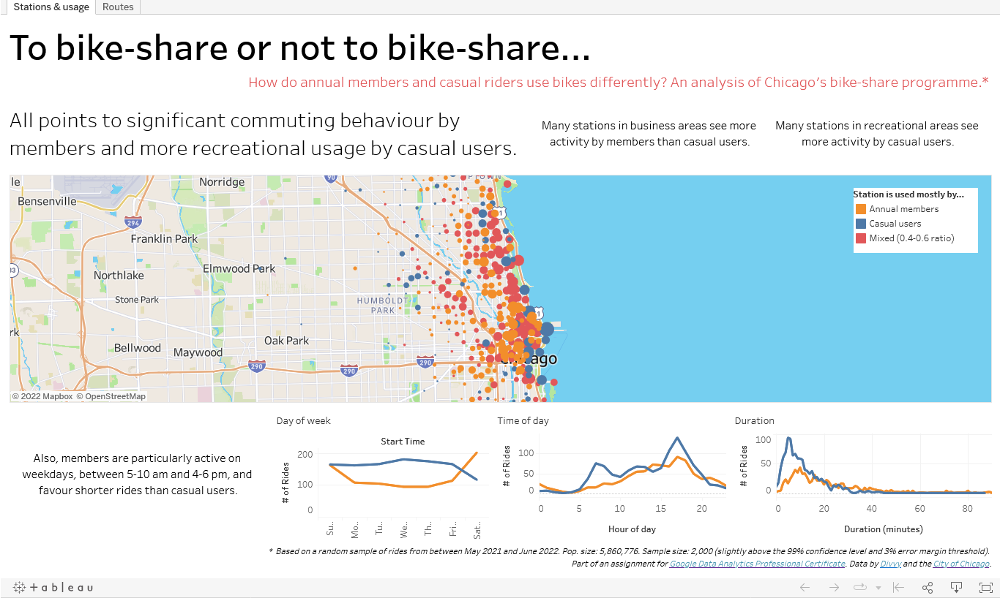
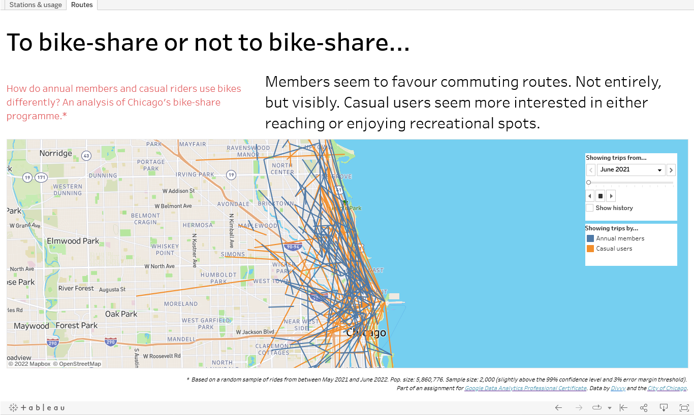

# Cyclistic Trilogy, Track A (SQL → Google Spreadsheets → Tableau)
## Executive Summary
I used data about Cyclistic's (a fictitious bike-share company, based on Divvy Chicago) rides and stations to understand differences in bike usage between casual users and annual members, which is needed to design a marketing campaign aimed at converting casual riders into annual members.

## Structure
The case study is part of [Google Data Analytics Professional Certificate](https://www.coursera.org/professional-certificates/google-data-analytics). I therefore used Google’s approach to data analysis, composed of six phases: ask, prepare, process, analyse, share, and act.

To learn about and compare different tools, I performed the analysis three times, each with different tools: (1) SQL → Google Spreadsheets → Tableau, (2) Excel → Power BI, (3) Python → MicroStrategy. This document details the first track, **SQL → Google Spreadsheets → Tableau.**


*Figure 1: Methodology (based on Google's data analysis approach).*

## Analysis

### Stage 1 (Ask)
**Business problem.** Cyclistic launched a bike-share offering in Chicago in 2016, which grew to 5,824 bikes across many stations. Cyclistic has three pricing plans: single-ride passes, full-day passes, and annual memberships. Annual memberships are most profitable, so there is interest in a marketing campaign to sell more annual memberships.

**Business task.** Lily Moreno, Cyclistic’s Director of Marketing, believes the campaign should aim to convert users of single-ride and full-day passes (casual users) into annual members. To design the campaign, she wants to better understand, among other things, how annual members and casual riders use Cyclistic bikes differently?

**Stakeholders.** Table 1 summarises people/groups who are or could be interested in this project.

*Table 1: Project stakeholders.*

| Stakeholder | Notes |
| ------ | ------- |
|	Lily Moreno (Director of Marketing) | Responsible for the marketing campaigns and directly involved with this project. |
|	Cyclistic's Marketing Analytics Team | Responsible for collecting, analysing, and reporting data that helps guide Cyclistic’s marketing—could offer feedback and support. |
|	Cyclistic's Executive Team | In charge of Cyclistic’s wider strategy and sufficiently detail-oriented as to look closely at data analyses. Recommendations must be approved by them. |
|	Cyclistic’s users | Potentially affected by any changes to the service.  |
|	Chicago inhabitants | Potentially interested in or critical of the intended marketing campaign.  |

### Stage 2 (Prepare)
**Data sources.** The data pack included [12 CSV files](https://divvy-tripdata.s3.amazonaws.com/index.html) with Cyclistic rides for the past 12 months. I added a CSV file I found online with the names and exact coordinates of stations [the City of Chicago](https://data.cityofchicago.org/Transportation/Divvy-Bicycle-Stations/bbyy-e7gq/data).

**Data applicability.** Cyclistic is a fictitious company, but data comes from [Divvy](https://ride.divvybikes.com/), a real-world bike-share programme in Chicago run by Lyft and owned by the Chicago Department of Transportation. So, data does seem to offer a meaningful window into the activities of a bike-share programme, including usage differences between different types of riders.

**Data ethics.** The data is already publicly available from [Divvy](https://ride.divvybikes.com/data-license-agreement) and [the City of Chicago](https://data.cityofchicago.org/Transportation/Divvy-Bicycle-Stations/bbyy-e7gq/data). My usage is unlikely to increase ethical risks. Also, Divvy is covered by Lyft’s privacy policy, which, to my knowledge, complies with best practices and applicable regulation. Also, the data does not contain personal identifiable information (PII). Biases remain plausible, nonetheless. For instance, more demographic data is needed to determine if data is diverse and avoid analysis that reproduces pre-existing societal biases. Additional research on this matter is recommended.

**Data structure.** Table 2 summarises the structure, content, and main shortcomings of data files.

*Table 2: Structure and contents of data files.*

| Header | Content | Shortcomings |
| ------ | ------- | ------------ |
| **Trips files** || || |
| ride_id | Ride identifier (unique) | |
| rideable_type | Classic/electric | |
| started_at | Timestamp | | 	
| ended_at | Timestamp | |
| start_station_name | Name of station | Many empty entries. Station names match trips file, but station IDs do NOT. |
| start_station_id | Station ID | |
| end_station_name | Name of station | |
| end_station_id | Station ID | |
| start_lat | Latitude | Entries for rides from/to the same station vary slightly perhaps due to trips data referring to bikes’ exact location rather than station's. Differences are small and not an analytical problem, but they could complicate visualisation (especially if working with samples). |
| start_lng | Longitude | Same as above. |
| end_lat | Latitude |  Same as above. |
| end_lng | Longitude |  Same as above. |
| member_casual | Casual/annual	| |
| **Stations files** || || |
| ID | Station identifier (unique) | IDs do NOT match trips data. |
| Station name | Name of station | Names match names in trips files. |
| Total docks | # Of docks in station | |
| Docks in dervice | # Of working docks in station | |
| Status | In service / not in service | | 	
| Latitude | Latitude | |
| Longitude | Longitude | |
| Location | GPS coordinates | |

**Data integrity and credibility.** Thus, as summarised in table 3, while most integrity and credibility best practices are met, the null values in station columns need to be clarified and, if needed, addressed. Also, any relations between the trips and the stations files/data must be handled carefully.

*Table 3: Summary of data integrity and credibility.*

| Type | Description |
| ------ | ------- |
| **Physical integrity** || |
| Accuracy | Data seems to come from sensors, with start/end times calculated by the second and exact coordinates for each ride/station. |
| Completeness | While other columns are complete, the empty values in stations columns need to be addressed. |
| Consistency | All files with data about trips follow a similar logic/structure. That said, my usage of an additional file for stations does introduce a degree of inconsistency that needs to be considered if undertaking associations across files. |
| **Logical integrity** || |
| Entity | All rides in the trips data have a unique identifier. All stations in the stations data have a unique identifier. No evident duplicates found. |
| Referential | While stations names across files match, station IDs do not. |
| **Credibility (ROCCC)** || |
| Reliable | Cyclistic is a fictional company, but Divvy is real. Data can thus be considered internal and therefore reliable. |
| Original | Data is created upon usage, i.e., it comes from origin. |
| Comprehensive | Data offers a ride-by-ride overview of all trips. It is very comprehensive. |
| Current | Data offers insight into very recent rides and is therefore very current. |
| Cited | Data was cited by Google in its flagship data analysis certification programme. Additionally, Divvy is a salient bike-sharing programme. |

### Stage 3 (Process)
The full data pack is too large for Google Spreadsheets, but it is possible to use Google Spreadsheets for a quick exploratory analysis of a sample of observations.

I used [SurveyMonkey’s calculator](https://www.surveymonkey.com/mp/sample-size-calculator/) to calculate the recommended sample size. For a population of 5860776 trips, at a 99% confidence, and with a 3% margin of error, the recommendation was 1849 trips, but I queried 2000 trips in case there was a need to discard some during analysis.

**PostGre SQL.** To proceed as if working directly with Cyclistic’s database, I uploaded all data into an SQL database with two tables: trips and stations. A real database would be organised differently (a fact table for rides and dimension tables for user, bike, and member types). However, all I needed was to extract a random sample of observations. Recreating a relational database seemed an overkill.

```SQL
-- Trips table.
CREATE TABLE trips (
  ride_id VARCHAR,
  rideable_type VARCHAR,
  started_at TIMESTAMP,
  ended_at TIMESTAMP,
  start_station_name VARCHAR,
  start_station_id VARCHAR,
  end_station_name VARCHAR,
  end_station_id VARCHAR,
  start_lat NUMERIC,
  start_lng NUMERIC,
  end_lat NUMERIC,
  end_lng NUMERIC,
  member_casual VARCHAR );

-- Stations table.
CREATE TABLE stations (
  id VARCHAR,
  station_name VARCHAR,
  total_docks INTEGER,
  docks_in_service INTEGER,
  status VARCHAR,
  latitude NUMERIC,
  longitude NUMERIC,
  location VARCHAR );
```

I then imported all data as given using PostGre's PSQL tool.

```SQL
\COPY trips(ride_id, rideable_type, started_at, ended_at, start_station_name, start_station_id, end_station_name, end_station_id, start_lat, start_lng, end_lat, end_lng, member_casual) FROM 'C:\... \Trips-202###.csv' DELIMITER ',' CSV HEADER;

\COPY stations(id, station_name, total_docks, docks_in_service, status, latitude, longitude, location) FROM 'C:\Users\jboln\Desktop\Trips\Stations.csv' DELIMITER ',' CSV HEADER;

```
Finally, I queried the data while getting some cleaning done directly in the query:
*	trimmed string and removed unnecessary wording from string columns,
*	relabelled and changed order of columns for clarity,
*	filtered out latitude/longitude columns from the trips table,
*	filtered out station IDs from both tables,
*	and filtered out entries with null values in station columns.

The last of these steps was a risk, but a necessary one. I did not know why the fields where empty. It could have been related to sensor failures, or an aspect of Cyclistic's activities. Getting rid of rides with no station names equals assuming that patterns from entries with stations' names hold when thinking about the whole dataset.

Regardless, since I was working with a sample of observations, I would have gotten a relatively low number of observations of each kind (with/without station names). The risk of not having enough observations (of either type) to be confident in any of the results of the analysis was unacceptable. I had no option but to bite the bullet and get ride of entries without station names.

The conclusions will reflect the implications of this choice.

*(Working with a clustered sample would have refuted the point of using Google spreadsheets for a quick exploration. I would use a different tool for such analysis.)*

```SQL
-- Trips data.
SELECT Trim(ride_id) AS trip_id,
    Trim(member_casual) AS user_type,
    Trim(Split_Part(rideable_type, '_' , 1)) AS bike_type,
    Trim(start_station_name) AS start_station,
    Trim(end_station_name) AS end_station,
    started_at AS start_time,
    ended_at AS end_time
  FROM trips
  WHERE start_station_name IS NOT NULL
   AND end_station_name IS NOT NULL
  ORDER BY Random()
  LIMIT 2000;

-- Station data.
SELECT Trim(station_name) AS station,
    latitude,
    longitude
  FROM stations;

```
**Google Spreadsheets.** The next step was to upload queried data to Google Spreadsheets and continue cleaning:
* double checked content in general,
* double checked data types,
* searched for any cells still containing null values,
* reformatted datetimes for easier reading,
* calculated latitude, longitude, and coordinates for all entries by matching station names in both trips and stations data (with a vLookup) (which also means, hereon, the analysis is based on the station at which a trip started or ended rather than its exact location),
* deleted unnecessary suffixes from station names (some stations had suffixes for internal administrative purposes),
* added a handful of stations to the stations list, as the trips data contained more stations than the stations data (for coordinates, I used the most common latitude/longitude values in the trips data),
* re-checked data for nulls, blanks, or errors.

At this point, I was able to unify data from trips and stations tables into a single table that was sufficiently clean to start analysis.



*Figure 2: Snapshot of cleaned unified data (Google Spreadsheets).*

### Stage 4 (Analyse)
In line with the discoveries above, I focused analysis on the two aspects of bike-sharing that the data gives meaningful insight into: timing and location of rides/stations.

Below a summary of my approach to the spreadsheet document. The document can be found [here](https://docs.google.com/spreadsheets/d/1BhedMuJj7vVwe4kJSceKjMn0TLuPsCzu5PJrO4FiPyk/edit?usp=sharing).

**Timing.** Analysis of timing aspects of data was possible via pivot tables, which allowed me to rapidly create the following tables.
*	rides by month of the year and member type,
*	rides by day of the week and member type,
*	rides by hour of day and member type,
*	rides by duration and member type.

To avoid having to create a million pivots, I copied each generated pivot and pasted as values into a separate sheet with summary tables. I then added columns to each of these summary tables to calculate:
*	total number of rides,
*	percentage of rides from annual members,
*	and whether that percentage leaned towards usage by members, casual riders, or a truly mixed sample (defined as anything between a 40% and 60% ratio).

The tables suggested usage leans towards members during weekdays and between 5-10 am and 4-6pm, and that members seem to favour shorter rides than casual members, which suggests commuting-like behaviour by many annual and a more-recreational approach by casual users.

**Location.** Analysis of location was harder. I wanted to avoid premature mapping by getting a sense of which stations were most popular with each user type before visualising rides. Alas, I have never been to Chicago, so station names were somewhat meaningless at first.

I used pivots to generate two tables:
*	A list of end stations by number of rides and member type.
*	A list of stations (irrespective of whether they show in data as start or end stations) by total number of rides and member type.

Both tables supported the idea that, likely, many annual members use bikes for commuting and usage by casual users is more recreational.

### Stage 5 (Share)
**Tableau.** My initial steps with Tableau were as follows:
* I re-packaged the data back into separate trips and stations tables (Tableau works best when using relations between tables);
* I then uploaded the separate tables to Tableau using Google’s Connector (meaning, I connected directly to Google Spreadsheets, no CSVs involved);
* and, I got rid of station names and locations in the rides table, to use instead an internal station identifier (simplifies things).

 *Figure 3: Tableau's data source pane.*

Visualisation hereon was relatively straightforward. In a nutshell, I:
*	created a couple measures to get counts of rides and stations,
*	 created origin and destination points with MAKEPOINT() and the latitude/longitude in the stations lists,
*	created a path between origin and destination points using MAKELINE() and the origin and destination points above,
*	dragged and dropped a bunch of stuff in place to create line charts for the time/duration tables in the analysis,
*	dragged and dropped another bunch of stuff to create maps with stations and routes,
*	dragged and dropped yet more stuff to create a couple dashboards summarising everything.

The final dashboard is available [here](https://public.tableau.com/app/profile/jbolns/viz/CyclisticCaseStudy_16583129939090/Stationsusage). Below a couple screenshots.



*Figure 4: Dashboard showing stations and their most common user type.*



*Figure 5: Dashboard showing the route and member type of each ride in the sample.*

## Recommendations
### Stage 6 (Act)
To summarise, while annual members use the bike-share programme for significant commuting purposes, casual users tend to use Cyclistic’s bike-share programme in a recreational fashion.

Based on this finding and the analysis, three recommendations are possible:
*	At the strategic level, acknowledge that casual users are unlikely to use bikes as much as needed to offset the cost of an annual membership.
* At the messaging level, focus the marketing campaign on convenience rather than cost.
  * Example (Chicago inhabitants). No need to worry about logistics when running late to a picnic.
  * Example (Visitors). No need to figure out things while trying not to get lost in a new city.
*	Be playful. Strike a jovial tone in all marketing. Casual users already know the programme. The challenge is not communicating the existence of annual memberships but, rather, selling an experience.

Do note, however, that for reasons explained earlied and due to the exploratory nature of this analysis, the analysis did not cover trips that show in the original data as having no station name. If these null values resulted from sensor failures, the findings here are likely directly applicable to these observations. If these null values reflect an aspect of Cyclistic activities that makes these rides fundamentally different to those with stations name, a separate analysis is needed to determine if the findings here extend to rides showing no station names. This is a limitation, no doubt, but this was an exploratory analysis and the bulk of the data is made by entries with station names. Ergo, the analysis here covers the majority of Cyclistic activities.
