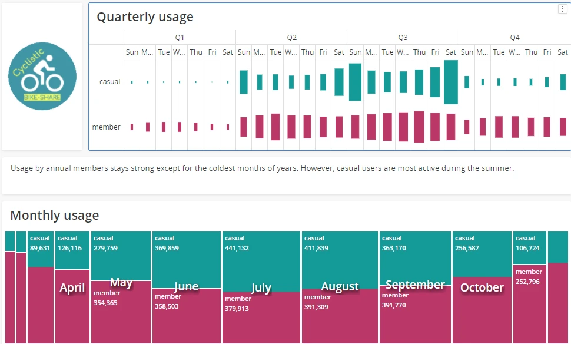

# Cyclistic Trilogy, Track C

## Executive Summary
I used data about Cyclistic's (a fictitious bike-share company, based on Divvy Chicago) rides and stations to understand differences in bike usage between casual users and annual members.

> The Jupyter (ipynb) file for this analysis is available [here](trackC.ipynb).

> The MicroStrategy (mstr) file for this analysis is available [here](https://drive.google.com/file/d/10lsjnfxAJobxUIOVdrtR-bRuRpzt8QdO/view?usp=sharing).

**!** The analysis is part of a larger exercise using different tools and approaches to the same data and is therefore not necessarily what I would do if working only with Python.

> Check [track A](../trackA/README.md) and [track B](../trackB/README.md) for other approaches to this dataset.

## Structure
Analysis follows Google’s approach to data analysis, composed of six phases: ask, prepare, process, analyse, share, and act.

To learn about and compare different tools, I performed the analysis three times, each with different tools: (1) SQL → Google Spreadsheets → Tableau, (2) Excel → Power BI, (3) Python → MicroStrategy.

This document details the third track, **Python → MicroAnalytics**.


*Figure 1: Methodology (based on Google's data analysis approach).*

## Analysis

### Stage 1 (Ask)
**Business problem.** Cyclistic launched a bike-share offering in Chicago in 2016, growing to 5,824 bikes across many stations. Three pricing plans are available: single-ride passes, full-day passes, and annual memberships. Annual memberships are most profitable. There is interest in a marketing campaign to sell more annual memberships.

**Business task.** Lily Moreno, Cyclistic’s Director of Marketing, believes the campaign should aim to convert users of single-ride and full-day passes (casual users) into annual members. To design the campaign, she wants to better understand, among other things, how annual members and casual riders use Cyclistic bikes differently?

**Stakeholders.** Table 1 summarises people/groups who are or could be interested in this project.

*Table 1: Project stakeholders.*

| Stakeholder | Notes |
| :--- | :--- |
| Lily Moreno (Director of Marketing) | Responsible for marketing campaigns. Directly involved in this project.|
| Cyclistic's Marketing Analytics Team | Responsible for collecting, analysing, and reporting data to guide Cyclistic’s marketing—could offer feedback and support.|
| Cyclistic's Executive Team | Detail-oriented - might look at analysis. Approves recommendations.|
| Cyclistic’s users | Potentially affected by any changes to the service.|
| Chicago inhabitants | Potentially interested in or critical of the intended marketing campaign.|

### Stage 2 (Prepare)
**Data sources.** The data pack included [12 CSV files](https://divvy-tripdata.s3.amazonaws.com/index.html) with Cyclistic rides between June 2021 and May 2022.

**Data applicability.** Cyclistic is a fictitious company, but data comes from [Divvy](https://ride.divvybikes.com/), a real-world bike-share programme in Chicago run by Lyft and owned by the Chicago Department of Transportation. So, data does seem to offer a meaningful window into the activities of a bike-share programme, including usage differences between different types of riders.

**Data ethics.** The data is already publicly available from [Divvy](https://ride.divvybikes.com/data-license-agreement). Usage here unlikely increases ethical risks. Additionally, Divvy is covered by Lyft’s privacy policy. Also, the data does not contain personal identifiable information (PII). Biases remain plausible. For instance, more demographic data would be needed to determine if data is diverse and avoid reproducing pre-existing societal biases. Additional research is therefore recommended.

**Data structure.** Table 2 summarises the structure, content, and main shortcomings of data files.

*Table 2: Structure and contents of data files.*

| Header | Content | Shortcomings |
| :--- | :--- | :--- |
| **Trips files** || || |
| ride_id | Ride identifier (unique) | |
| rideable_type | Classic/electric | |
| started_at | Timestamp | | 	
| ended_at | Timestamp | |
| start_station_name | Name of station | Many empty entries. Station names match trips file, but station IDs do NOT. |
| start_station_id | Station ID | |
| end_station_name | Name of station | |
| end_station_id | Station ID | |
| start_lat | Latitude | Entries for rides from/to the same station vary slightly (perhaps due to refering to bikes’ exact location rather than station's). Differences are small and not an analytical problem, but they could complicate visualisation (especially if working with samples). |
| start_lng | Longitude | Same as above. |
| end_lat | Latitude |  Same as above. |
| end_lng | Longitude |  Same as above. |
| member_casual | Casual/annual	| |

**Data integrity and credibility.** Thus, as summarised in table 3, while most integrity and credibility best practices are met, the null values in station columns need to be clarified and, if needed, addressed.

*Table 3: Summary of data integrity and credibility.*

| Type | Description |
| :--- | :--- |
| **Physical integrity** || |
| Accuracy | Data seems to come from sensors, with start/end times by the second and exact coordinates for each ride. |
| Completeness | Most columns are complete, but there are many empty values in stations columns. |
| Consistency | All files with data about trips follow a similar logic/structure. |
| **Logical integrity** || |
| Entity | All rides in the trips data have a unique identifier. |
| Referential | No problems were identified. |
| **Credibility (ROCCC)** || |
| Reliable | Cyclistic is a fictional company, but Divvy is a real bike-share programme. Data can be considered internal and therefore reliable. |
| Original | Data is created upon usage, i.e., it comes from origin. |
| Comprehensive | Data offers a ride-by-ride overview of all trips. It is very comprehensive. |
| Current | Data offers insight into very recent rides and is therefore very current. |
| Cited | Data was cited by Google in its flagship data analysis certification programme. Additionally, Divvy is a salient bike-sharing programme. |

### Stage 3 (Process)
**Loading the data.** The first step was to load all trips data into a Pandas dataframe.


```python
import pandas as pd
import os
import statsmodels.api as sm
import statsmodels.formula.api as smf
from sklearn.model_selection import train_test_split
from sklearn.metrics import accuracy_score
```


```python
# FUNCTION TO READ EACH DATA FILE
def f(file): 
    return pd.read_csv(file,header=None,\
                    skiprows=1,\
                    na_filter=False, \
                    dtype=str\
                    )

# FUNCTION TO LOAD AND CONCATENATE DATA
def concatenate_data(file_list):
    
    # Concatenate data without including headers
    df = pd.concat(map(f, file_list))
    
    # Add headers once
    df.columns = pd.read_csv(file_list[0], nrows=0).columns
    
    # Return joint dataframe
    return df

# RUN FUNCTIONS
data_folder = os.path.expanduser('~\Desktop/data/trips') # I have data here, but this folder can be adjusted as needed
file_list = [data_folder + "/" + f for f in os.listdir(data_folder)]
df = concatenate_data(file_list)
```

**Cleaning the data.** Then came the need for cleaning the data. 

Based on previous exploration of the data undertaken in the course of producing [track A](../trackA/README.md) and [track B](../trackB/README.md) of this analytical trilogy, clean up required:
* removing unnecessary columns: start_station_id, end_station_id
* removing rows with n/a values in columns other than station names
* removing duplicates ride ids
* changing date columns to datetime
* changing latitude and longitude columns to floats
* creating a calculated duration column (easier to interpret than end time)
* Relabelling 'docked' types to 'classic' ("docked" label seems a historical glitch, as it pre-dates the other types)
* Discarding trips of type 'classic' for which end station is NULL (likely damaged or stolen bikes)
* Relabelling all remaining empty station names as "Free Standing".


```python
# FUNCTION TO CLEAN THE JOINT DATA
def clean_data(df):
    
    # Drop unnecesary columns
    df.drop(["start_station_id","end_station_id"], axis=1, inplace=True)
    
    # If they exist, drop empty values on columns except station names
    df.dropna(how="all", inplace=True, subset=["ride_id",\
                                    "rideable_type", "started_at", "ended_at",\
                                    "start_lat", "start_lng",\
                                    "end_lat", "end_lng",\
                                    "member_casual"])
    
    # If they exist, drop duplicate ride IDs
    clean_df = df[~df.duplicated(subset=["ride_id"], keep='first')]
    
    # Change date columns to datetime and latitude/longitude to floats
    clean_df[["started_at", "ended_at"]] = clean_df[["started_at", "ended_at"]].apply(pd.to_datetime)
    
    # Change latitude/longitude columns to floats
    clean_df[["start_lat", "start_lng", "end_lat", "end_lng"]] = clean_df[["start_lat", "start_lng", "end_lat", "end_lng"]].apply(pd.to_numeric).round(4)
    
    # Add a calculated duration column
    clean_df["duration"] = clean_df["ended_at"] - clean_df["started_at"]
    
    # Relabel bike types for easier comprehension and visualisation
    clean_df["rideable_type"] = clean_df["rideable_type"].replace({"electric_bike": "electric", "classic_bike": "classic", "docked_bike": "classic"})
    
    # Discard trips of type 'classic' with end station is NULL (damaged or stolen)
    idx = (clean_df["rideable_type"] == "classic") & (clean_df["end_station_name"] == "")
    clean_df = clean_df[~idx]
    
    # Relabel remaining empty station names as "Free Standing"    
    clean_df["start_station_name"] = clean_df["start_station_name"].replace({"":"Free Standing"})
    clean_df["end_station_name"] = clean_df["end_station_name"].replace({"":"Free Standing"})
    
    #Return clean dataframe
    return clean_df

# RUN FUNCTIONS
df = clean_data(df)
```

### Stage 4 (Analyse)
At this point, the data was sufficiently clear to begin analysis.

**Splitting data.** The dataset has features of three different types: categorical, chronological and geographical. I decided to split the data into panels corresponding to each of these types:
    
* **X1.** Categorical features directly available in the data, i.e., ride type
* **X2.** Chronological features extracted from start and end timestamps
* **X3.** Geographical features station names and latitudes/longitudes.

The separation will make it hard to consider interactions between features in different panels. That said, I prefer to first examine simple causal explanations. If the variables in any panel already tell a story, that's it. If not, it is still possible to concatenate panels to consider more complex interactions.

Addditionally, I also extracted the outcome column into a **"y_factors"** column of its own. This column is a boolean column where 0s correspond to members and 1s to casual riders.     


```python
# Function to split data into different types of features
def split_data(df):
    y_factors = df["member_casual"]
    y_factors, y_keys = pd.factorize(df["member_casual"])
    X1 = pd.DataFrame(df["rideable_type"])
    X2 = pd.DataFrame(df[["started_at", "ended_at", "duration"]])
    X3 = pd.DataFrame(df[["start_station_name", "end_station_name", "start_lat", "start_lng", "end_lat", "end_lng"]])
    return X1, X2, X3, y_factors

# RUN FUNCTIONS
X1, X2, X3, y_factors = split_data(df)
```

**Analysing the feature types.** I analysed each of the panels through logistic regression. As follows.

#### X1
After converting ride types into either classic or eletric, the rideable_type in X1 is essentially a boolean feature. This allows straightforward regression.


```python
# Function to analyse categorical data
def analyse_boolean(X,y):
    
    # Factorise features
    X_factors, X_keys = X.apply(lambda x: pd.factorize(x)[0]), X.apply(lambda x: pd.factorize(x)[1])
    
    # Create a new fold
    X_train, X_test, y_train, y_test = train_test_split(X_factors, y, test_size=0.2)
    
    # Fit model using train subset
    fit = sm.Logit(y_train, X_train).fit()
    
    # Make predictions using test subset
    y_predict = round(fit.predict(X_test)).astype(int)
    
    # Calculate model accuracy
    y_predict = round(fit.predict(X_test))
    acc = accuracy_score(y_predict, y_test)
    
    return fit.params.sort_values(), X_keys, acc

#RUN FUNCTIONS
X1_params, X1_keys, X1_accuracy = analyse_boolean(X1, y_factors)
```

```python
print(f'The accuracy of this model is: {X1_accuracy} \n')
```

Alas, this panel does not offer much in way of a consistent explanation for ridership differences between members and casual riders. 

To begin, the rideable_type is but-a single feature. Categorical features of the sort tend to be very helpful when many are available. For example, if the data also contained categories for gender, age_group, and so forth, the combined categories could potentially tell a story. A single categorical feature alone would always open room for questions. 

Additionally, as detailed earlier, the rideable_type used to contain a "docked" category, which was recoded into classic for consistency. The problem, however, is that this recoding was based on research made in addition to the details in the dossiers. The dossier has no actual explanation for what this "docked" category is. Ergo, there is room for mistakes. 

After considering this two matters, only a really high accuracy would justify making inferences based on rideable_type. Alas, while the accuracy of the model is a bit better than a coin toss, it is also not incredibly high.

So, I decided to move on to the next panel without making conclusions based on X1.

#### X2
X2 contains a number of features derived from the start_times in the database.

Timestamps are quite a nifty thing. They might go unnoticed due to being a single data point. However, they can conceal a significant amount of information related to temporal behavioural patterns.

For instance, I used the timestamps in the "started_at" column to create new columns to determine the **"quarter"** in which a ride took place and whether the ride took place inside **"business_hours"** and in a **"business_day"**.

I was then able to run a logistic regression using these three columns and the **"duration"** column originally in the dataset.

```python
def analyse_chronological(X,y):
    
    # Construct features dataframe
    X_time = pd.DataFrame()
    X_time["start_month"] = X["started_at"].dt.month_name()
    X_time["quarter"] = X["started_at"].dt.quarter.astype(str)
    X_time["start_weekday"] = X["started_at"].dt.day_name()
    X_time["business_day"] = X["started_at"].dt.weekday.replace({1: "Workday", 2: "Workday", 3: "Workday", 4: "Workday", 5: "Weekend", 6: "Weekend", 7: "Weekend"})
    X_time["start_hour"] = X["started_at"].dt.hour
    X_time["business_hours"] = X_time["start_hour"].replace({0: "Non-office hours", 1: "Non-office hours", 2: "Non-office hours", 3: "Non-office hours", 4: "Non-office hours", 5: "Non-office hours", 6: "Non-office hours", 7: "Non-office hours", 8: "Non-office hours", 9: "Office hours", 10: "Office hours", 11: "Office hours", 12: "Office hours", 13: "Office hours", 14: "Office hours", 15: "Office hours", 16: "Office hours", 17: "Office hours", 18: "Non-office hours", 19: "Non-office hours", 20: "Non-office hours", 21: "Non-office hours", 22: "Non-office hours", 23: "Non-office hours"})
    X_time["start_hour"] = X_time["start_hour"].astype(str)
    X_time["duration"] = round(X["duration"].dt.seconds/60).astype(int)
    
    # Add outcomes to dataframe
    X_time["y"] = y
       
    # Partition dataframe into train and test segments
    X_train, X_test = train_test_split(X_time,test_size=0.2)
    
    # Fit model using train subset
    fit = smf.logit(formula="y ~ quarter + business_day + business_hours + duration", data=X_train).fit()
    
    # Make predictions using test subset
    y_predict = round(fit.predict(X_test)).astype(int)
    
    # Calculate accuracy
    y_predict = round(fit.predict(X_test))
    acc = accuracy_score(y_predict, X_test["y"])
      
    return fit.params.sort_values(), acc

# RUN FUNCTIONS
X2_params, X2_accuracy = analyse_chronological(X2, y_factors)
```


```python
print(f'The accuracy of this model is: {X2_accuracy} \n')
print("The coefficients are:")
print(X2_params)
```

The accuracy of this model starts to look a bit more convincing. The model achieves 65% correct predictions using a test panel.

Also, the coefficients tell a very consistent story.

For context. Low coefficients suggest the factor is not strongly correlated with casual ridership, whereas high coefficients suggest the factor is correlated with casual ridership. 

Factors that are *NOT* correlated with casual ridership are business_hours and business_day. In other words, trips during business hours and in business days are more likely to be by members than casual users. 

Conversely, factors strongly correlated with casual ridership are quarters 2 and 3, and weekends. In other words, trips taking place during summer and/or in a weekend are more likely to be by casual users than members.

It does seem that **casual users tend to use the service more during weekends and in summer times**, i.e., for **recreational purposes**.

#### X3
The geographical variables tell a similar story. 

X3 contains names of stations and start/end geographical coordinates. These are slightly harder to analyse statistically because there are many, many stations and geographical coordinates. So, I had to subset the data. 

I initially thought about subsetting based on station numbers. The problem with this was that stations can be quite close to one another. I wanted rougher categories that spoke of general areas of the city, rather than precise spots. 

To achieve this, I used the geographical coordinates. I remembered that the precision of geographical coordinates is very well defined. Coordinates with two decimals point have a precision of about 1.1 km. 

So, I joined start and end coordinates into a single array with coordinate pairs of up to two decimals. Accordingly, all rides starting or ending in the same area end up categorised with the same coordinate label. 

This then allowed me to run a regression based on the most frequented destinations in the city.


```python
# This function will take a bit to run. 
def analyse_geographical(X,y):
    
    # Construct geographical features dataframe
    X_geo = pd.DataFrame()
    X_geo["coords"] = pd.concat([X["start_lat"], X["end_lat"]], ignore_index=True).map('{:,.2f}'.format) + ", " + pd.concat([X["start_lng"], X["end_lng"]], ignore_index=True).map('{:,.2f}'.format)
    X_geo["y"] = pd.concat([pd.Series(y), pd.Series(y)], ignore_index=True)
    top_coords = X_geo["coords"].value_counts().nlargest(80).index
    X_geo = X_geo[X_geo["coords"].isin(top_coords)]

    # Partition dataframe into train and test segments
    X_train, X_test = train_test_split(X_geo,test_size=0.2)

    # Fit model using train subset
    fit = smf.logit(formula="y ~ coords", data=X_train).fit()
    
    # Make predictions using test subset
    y_predict = round(fit.predict(X_test)).astype(int)

    # Calculate accuracy
    y_predict = round(fit.predict(X_test))
    acc = accuracy_score(y_predict, X_test["y"])
    
    return fit.params.sort_values(), acc

# RUN FUNCTIONS
X3_params, X3_accuracy = analyse_geographical(X3, y_factors)
```


```python
print(f'The accuracy of this model is: {X3_accuracy} \n')
print("The stations less strongly correlated with casual riders are:")
print(X3_params[0:10])
print("\n The stations correlated with casual riders are:")
print(X3_params[-10:])
```

The accuracy of results was also above 60%. Moreover, the coefficients told a consistent story matching previous findings.

Coordinates with low coefficients are in business areas of the city. For instance, coordinates (41.79, -87.60) correspond to an area of the city that houses the University of Chicago, whereas (41.87, -87.67) correspond to the Illinois Medical District. These two points are both close to the Chicago Loop, the central business area of the city. Other coordinates with low coefficients are close to Chicago's financial district.

Alternately, coordinates with high coefficients tend to be leisure/touristic destinations. For instance, (41.89, -87.61) is a lake-front spot near Navy Pier and the Millenium Park, and (41.96, -87.64) is also a lake-front area near Montrose Beach/Harbor. Coordinates with high coefficients that are not lake-front are also leisure points. For instance, (41.85, -87.63) is just next to ChinaTown, a restaurant area and one of Chicago's top-things-to-do for tourists.

It does seem, therefore, that differences in member/casual riderships relate to whether trips are being taken for business or leisure reasons.

Members seem to use bikes for commuting purposes, while casual users tend to ride outside of business times and visit more leisurely areas.

### Stage 5 (Share)

Since the idea here is to make the most of several different tools, I opted to visualise using a business intelligence (BI) solutions known as MicroStrategy. MicroStrategy is popular amongst very large organisations. It is similar to Tableau or PowerBI, oriented towards the heavy-duty side of things. It is an excellent choice when dealing with many features and millions of rows.

#### Uploading data
Uploading the data into MicroStrategy was not particularly difficult. MicroStrategy is geared towards heavy-duty usage. Uploading a massive CSV is as easy as clicking import, particularly when the dataset is already clean as in our case.


*Figure 2: Snapshot of dashboard.*

#### Visualising the data
MicroStrategy works with something called "dossiers", a book-like collection of dashboards. This allows for a relatively straightforward story-telling approach with introductions and chapters.

##### Introduction
So, the first visualisation is an introduction to the project.


*Figure 3: Snapshot of dashboard.*

##### Chapter 1. Seasonal and daily trends
Then came a couple pages of charts about the seasonal and daily dynamics already covered. These charts visualise how members tend to use bikes during peak commuting times and in business days, whereas casual users favour holidays and weekends.




*Figure 4: Snapshot of dashboard.*


*Figure 5: Snapshot of dashboard.*

##### Chapter 2. Geographical trends
The final chapter refers to location and geographical patterns in the data. The visuals in this chapter are slightly more complex than the ones before and require a small explanation. However, they convey a lot of information in a very small space.

The first visualisation shows start and end stations by members. The stations on the left are the most commonly used start stations. The stations on the right are the most commonly used end stations. The flows go by a "member" or "casual" category that shows the most common user type for each station/route.


The second visualisation is a map of start/end geographical coordinates in the dataset, with two decimals of precision. Light markers signal usage mainly by members; dark markers signal a higher casual usage ratio. The map is zoomable in the dossier, which makes it easier to see patterns. That said, even a general view such as the one in the picture below shows a lighter region around the middle. 

The darker line along the shoreline explains itself: major recreational spots. The darker areas around the city are too far from the centre to allow commuting in a bike-share bike. Long-distance bike commuters tend to use faster bikes that can travel the distance efficiently. Ergo, usage beyond a reasonable distance from the city centre is expected to be predominantly casual.

*Figure 6: Snapshot of dashboard.*


*Figure 7: Snapshot of dashboard.*

### Stage 6 (Act)

Findings in this track align with findings in [track A](../trackA/README.md) and [track B](../trackB/README.md). While not exclusively, annual members use Cyclistic's bikes for significant commuting purposes. In turn, casual users approach the programme more recreationally. 

Three recommendations are possible:
* At the strategic level, acknowledge that casual users are unlikely to use bikes as much as needed to offset the cost of an annual membership.
* At the messaging level, focus the marketing campaign on convenience rather than cost.1
    * Example (Chicago inhabitants). No need to worry about logistics when running late to a picnic.
    * Example (Visitors). No need to figure out things while trying not to get lost in a new city.
* Finally, be playful. Strike a jovial tone in all marketing. Casual users already know the programme. The challenge is not communicating the existence of annual memberships but, rather, selling an experience.

Also, do recall this is the third installment in a broader analytical exercise using three different approaches and several different tools. The alignment between findings across tracks demonstrates there is no one single best approach to data analysis. Making the most from any given tool and approach. That's beauty.

